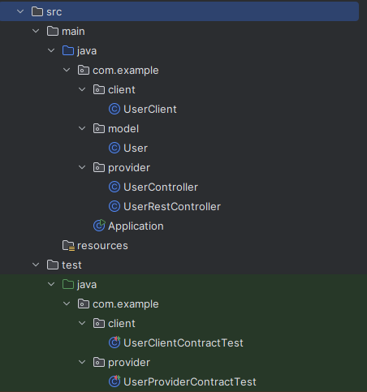

# Contract Testing

A minimal Spring Endpoint and Client to test out Consumer Driven Contract Testing.

## Project Structure
The Project retrieves Users over an Endpoint. 
The User client can send a GET request to /users/{id}. 
The User Rest Controller returns Users with such an id - if they exist.

## Sources
Some Sources I used:
- https://pactflow.io/blog/what-is-contract-testing/
- https://medium.com/contract-testing/introduction-to-contract-testing-a02156fb1279
- https://www.baeldung.com/pact-junit-consumer-driven-contracts
- https://docs.pact.io/implementation_guides/jvm/consumer/junit
- https://github.com/pact-foundation/pact-workshop-jvm-spring
